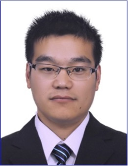

# Pichao Wang, PhD, Prime Video - Amazon

[**AI 2000 Most Influential Scholar**](https://www.aminer.cn/ai2000/search_rank?id=562c81d345cedb3398c44362)

[**World's Top 2% Scientist named by Stanford University**](https://ecebm.com/2021/10/26/stanford-university-names-worlds-top-2-scientists-2021/)

[**CVPR 2022 Best Student Paper Recipient**](https://cvpr2022.thecvf.com/cvpr-2022-paper-awards)

Email: pichaowang@gmail.com   [Goolge Scholar](https://scholar.google.com/citations?user=QozdnnoAAAAJ&hl=en) [ResearchGate](https://www.researchgate.net/profile/Pichao-Wang) [Linkedin](https://www.linkedin.com/in/pichao-wang-494773109/)

I am recruiting Research Interns (PhD or excellent master candidates) to join my research project @ Amazon Prime Video. If you are interested in computer vision, especially transformer-based applications, and happens to be interested in Prime Video, please contact me.

## Recent News

1. 2022-12: Our TIP'21 paper received the IEEE Finland SP/CAS Best Paper Award
2. 2022-11: One paper about Semantic Segmentation was accepted by **AAAI2023**
3. 2022-11: One paper about Neural Style Transfer was accepted by **AAAI2023**
4. 2022-09: One paper about skeleton action recognition was accepted by **ACCV 2022**
5. 2022-09: One paper about vision transformer compression was accepted by **NeurIPS 2022**
6. 2022-07: One paper about vision transformer was accepted by **ECCV 2022**
7. 2022-07: One paper about unsupervised semantic segmentation was accepted by **ECCV 2022**
8. 2022-06: **Best Student Paper Award** in **CVPR 2022**.
9. 2022-03: One paper about 3D human pose estimation was accepted by **CVPR 2022**.
10. 2022-03: One paper about 3D object detection was accepted by **CVPR 2022**.
11. 2022-03: One paper about RGB+D motion recognition was accepted by **CVPR 2022**.
12. 2022-01: One paper about knowledge distillation was accepted by **ICASSP 2022**.
13. 2022-01: One paper about unsupervised domain adaption was accepted by **ICLR 2022**.
14. 2021-12: One paper about pose estimation was accepted by **IEEE TMM**. 
15. 2021-12: One paper about vision transformer training was accepted by **AAAI 2022**.
16. 2021-07: One paper about Object ReID was accepted by **ICCV 2021**.
17. 2021-07: One paper about Zero-Shot NAS was accepted by **ICCV 2021**.
18. 2021-06: One paper about video object detection was accepted by **IJCV**.
19. 2021-06: One paper about video object detection was accepted by **IEEE TCSVT**.

## Biography

I am a senior research scientist at Amazon Prime Video. Before I joined Prime Video, I worked as a staff/senior engineer at DAMO Academy, Alibaba Group (U.S.) for more than 4 years. I received my Ph.D in Computer Science from [University of Wollongong](https://www.uow.edu.au/media/2022/new-high-for-uow-in-qs-world-university-rankings.php), Australia, in Oct. 2017, supervised by Prof. [Wanqing Li](https://sites.google.com/view/wanqingli/home-news) and Prof. [Philip Ogunbona](https://documents.uow.edu.au/~philipo/).  I received  my M.E. in Information and Communication Engineering from [Tianjin University](http://www.tju.edu.cn/english/index.htm), China, in 2013, supervised by Prof. [Yonghong Hou](http://seea.tju.edu.cn/info/1122/2098.htm), and B.E. in Network Engineering from [Nanchang University](http://english.ncu.edu.cn/), China, in 2010.

## Research Interests

Computer Vision · Multimedia · Deep Learning · Image Representation · Video Understanding

## Selected Awards and Honors

1. Jun.2022, [Best Student Paper Award](https://cvpr2022.thecvf.com/cvpr-2022-paper-awards) @CVPR2022

2. Jan.2022, AI 2000 Most Influential Scholars [certificate](https://github.com/wangpichao/wangpichao.github.io/blob/main/images/miner.png)

3. Oct.2021, World’s Top 2% Scientists

4. Jun. 2020, Second Prize, Multiple Object Tracking and Segmentation@CVPR2020 

5. May. 2018, EIS Faculty Postgraduate Thesis Award.

6. Aug. 2017, Second Prize, Action, Gesture, and Emotion Recognition Workshop and Competitions: Large Scale Multimodal Gesture Recognition and Real versus Fake expressed emotions@ICCV2017

7. Apr. 2017 First Prize (Winner), Large Scale 3D Human Activity Analysis Challenge in Depth Video@ICME2017

8. Dec. 2016 Second Prize, Joint Contest on Multimedia Challenges Beyond Visual Analysis@ICPR2016

9. Dec. 2016 Third Prize, Joint Contest on Multimedia Challenges Beyond Visual Analysis@ICPR2016

10. Jan. 2013 Excellent Postgraduate Award

11. Dec. 2011 Excellent Prize, National Campus CUDA Programming Contest. [certificate](https://sites.google.com/site/pichaossites/resources/img051.jpg?attredirects=0&d=1)

## Publications

### Ph.D. Dissertation

Action Recognition from RGB-D Data. The University of  Wollongong, 2017. (Best Postgraduate Thesis Award) [link](http://ro.uow.edu.au/theses1/112/)

### Preprint (selected papers, [full paper list](https://scholar.google.com/citations?user=QozdnnoAAAAJ&hl=en))

1. Jingkai Zhou, **Pichao Wang**@, Fan Wang, Qiong Liu, Hao Li, Rong Jin,(@project lead), "ELSA: Enhanced Local Self-Attention for Vision Transformer", arXiv 2021. [paper](https://arxiv.org/pdf/2112.12786.pdf). [code](https://github.com/damo-cv/ELSA)

2. Hao Luo, **Pichao Wang**, Yi Xu, Feng Ding, Yanxin Zhou, Fan Wang, Hao Li, Rong Jin, "Self-Supervised Pre-Training for Transformer-Based Person Re-Identification", arXiv 2021. [paper](https://arxiv.org/pdf/2111.12084.pdf). [code](https://github.com/damo-cv/TransReID-SSL)

### Conference Papers (selected papers, [full paper list](https://scholar.google.com/citations?user=QozdnnoAAAAJ&hl=en))

1. Bo Dong, **Pichao Wang**@, Fan Wang,(@ Corresponding author), "Head-Free Lightweight Semantic Segmentation with Linear Transformer", AAAI 2023.[paper](https://arxiv.org/pdf/2301.04648.pdf) [code](https://github.com/dongbo811/AFFormer)

2. Dongyang Li, Hao Luo, **Pichao Wang**, Zhibin Wang, Shang Liu, Fan Wang, "Frequency Domain Disentanglement for Arbitrary Neural Style Transfer", AAAI 2023.

3. Zhenyu Wang, Hao Luo, **Pichao Wang**, Feng Ding, Fan Wang, Hao Li, "VTC-LFC: Vision Transformer Compression with Low-Frequency Components", NeurIPS 2022.[paper](https://openreview.net/pdf?id=HuiLIB6EaOk) [code](https://github.com/Daner-Wang/VTC-LFC)

4. **Pichao Wang**, *Xue Wang*, Fan Wang, Ming Lin, Shuning Chang, Hao Li, Rong Jin, (first two authors make equal contributions), "KVT: k-NN Attention for Boosting Vision Transformers", ECCV 2022. [paper](https://arxiv.org/pdf/2106.00515.pdf). [code](https://github.com/damo-cv/KVT)

5. Zhaoyuan Yin, **Pichao Wang**@, Fan Wang, Xianzhe Xu, Hanling Zhang, Hao Li, Rong Jin,(@ Corresponding author), "TransFGU: A Top-down Approach to Fine-Grained Unsupervised Semantic Segmentation", ECCV 2022, ***Oral***(2.7% of submitted papers) [paper](https://arxiv.org/pdf/2112.01515.pdf). [code](https://github.com/damo-cv/TransFGU)

6. Benjia Zhou, **Pichao Wang**@, Jun Wan, Yanyan Liang, Fan Wang, Du Zhang, Zhen Lei, Hao Li, Rong Jin, (@ Corresponding author), "Decoupling and Recoupling Spatiotemporal Representation for RGB-D-based Motion Recognition", CVPR 2022. [paper](https://arxiv.org/pdf/2112.09129.pdf). [code](https://github.com/damo-cv/MotionRGBD)

7. Hansheng Chen, **Pichao Wang**@, Fan Wang, Wei Tian, Lu Xiong, Hao Li, (@ Corresponding author), "EPro-PnP: Generalized End-to-End Probabilistic Perspective-n-Points for Monocular Object Pose Estimation", CVPR 2022, ***Best Student Paper Award***. [paper](https://arxiv.org/pdf/2203.13254.pdf) [code](https://github.com/tjiiv-cprg/EPro-PnP)

8. Wenhao Li, Hong Liu, Hao Tang, **Pichao Wang**, Luc Van Gool, "MHFormer: Multi-Hypothesis Transformer for 3D Human Pose Estimation", CVPR 2022. [paper](https://arxiv.org/pdf/2111.12707.pdf). [code](https://github.com/Vegetebird/MHFormer)

9. **Pichao Wang**, Fan Wang, Hao Li, "Image-to-Video Re-Identification via Mutual Discriminative Knowledge Transfer", ICASSP 2022. [paper](https://www.researchgate.net/publication/358008989_IMAGE-TO-VIDEO_RE-IDENTIFICATION_VIA_MUTUAL_DISCRIMINATIVE_KNOWLEDGE_TRANSFER)

10. Tongkun Xu, Weihua Chen, **Pichao Wang**, Fan Wang, Hao Li, Rong Jin, "Cdtrans: Cross-domain transformer for unsupervised domain adaptation", ICLR 2022. [paper](https://arxiv.org/pdf/2109.06165.pdf). [code](https://github.com/CDTrans/CDTrans)

11. **Pichao Wang**, *Xue Wang*, Hao Luo, Jingkai Zhou, Zhipeng Zhou, Fan Wang, Hao Li, and Rong Jin,(first two authors make equal contributions), "Scaled relu matters for training vision transformers", AAAI 2022. [paper](https://arxiv.org/abs/2109.03810). [video](https://recorder-v3.slideslive.com/#/share?share=57843&s=123e71d8-018a-41fa-a13f-1f18a969188c)

12. Shuting He, Hao Luo, **Pichao Wang**, Fan Wang, Hao Li, and Wei Jiang, "TransReid: Transformer-based Object Re-identification",ICCV 2021. [paper](https://openaccess.thecvf.com/content/ICCV2021/papers/He_TransReID_Transformer-Based_Object_Re-Identification_ICCV_2021_paper.pdf). [code](https://github.com/damo-cv/TransReID)

13. Min Lin, **Pichao Wang**, Zhenhong Sun, Hesen Chen, Xiuyu Sun, Qi Qian, Hao Li, and Rong Jin, "Zen-NAS: A Zero-Shot NAS for High-Performance Deep Image Recognition", ICCV 2021. [paper](https://arxiv.org/pdf/2102.01063.pdf). [code](https://github.com/idstcv/ZenNAS)
 
14. *Liang Han*, **Pichao Wang**, Zhaozheng Yin, Fan Wang, and Hao Li, (*first two authors make equal contributions*) "Exploiting Better Feature Aggregation for Video Object Detection", ACM MM 2020. [paper](https://par.nsf.gov/servlets/purl/10289758)

15. Chang Tang, Xinwang Liu, Xinzhong Zhu, En Zhu, Kun Sun, **Pichao Wang**, Lizhe Wang and Albert Zomaya, "R2MRF: Defocus Blur Detection via Recurrently Refining Multi-scale Residual Features", AAAI 2020.[paper](https://ojs.aaai.org/index.php/AAAI/article/download/6884/6738). [code](https://github.com/ChangTang/R2MRF)

16. **Pichao Wang**, Wanqing Li, Jun Wan, Philip Ogunbona, and Xinwang Liu, "Cooperative Training of Deep Aggregation Networks for RGB-D Action Recognition", AAAI 2018, ***ORAL*** [paper](https://sites.google.com/site/pichaossites/resources/AAAI2018_action.pdf?attredirects=0&d=1). [code](https://sites.google.com/site/pichaossites/resources/codesAAAI.zip?attredirects=0&d=1)
  
17. *Huogen Wang*, **Pichao Wang**, Zhanjie Song, and Wanqing Li, (first two authors make equal contributions) "Large-scale Multimodal Gesture Recognition Using Heterogeneous Networks", ICCV 2017.[paper](https://sites.google.com/site/pichaossites/resources/Heterogeneous.pdf?attredirects=0&d=1). [code](https://github.com/wanghuogen/ConGestureChallenge4ICCV)
  
18. *Huogen Wang*, **Pichao Wang**, Zhanjie Song, and Wanqing Li, (first two authors make equal contributions) "Large-scale Multimodal Gesture Segmentation and Recognition based on Convolutional Neural Network", ICCV 2017. [paper](https://sites.google.com/site/pichaossites/resources/CNN_ICCV_2017_paper.pdf?attredirects=0&d=1). [code](https://github.com/wanghuogen/ConGestureChallenge4ICCV-DF)
  
19. **Pichao Wang**, Wanqing Li, Zhimin Gao, Yuyao Zhang, Chang Tang, and Philip Ogunbona, "Scene Flow to Action Map: A New Representation for RGB-D Based Action Recognition with Convolutional Neural Networks", CVPR 2017.  [paper](https://arxiv.org/pdf/1702.08652.pdf)
   
20. **Pichao Wang**, *Zhaoyang Li*, Yonghong Hou, and Wanqing Li, (first two authors make equal contributions) "Action Recognition Based on Joint Trajectory Maps Using Convolutional Neural Networks", ACM MM 16. [paper](https://sites.google.com/site/pichaossites/resources/p102-wang.pdf?attredirects=0&d=1). [code](https://sites.google.com/site/pichaossites/resources/JTM-rotate-ntu.zip?attredirects=0&d=1)
  
21. **Pichao Wang**, Wanqing Li, Zhimin Gao, Chang Tang, Jing Zhang, and Philip Ogunbona,"ConvNets-Based Action Recognition from Depth Maps Through Virtual Cameras and Pseudocoloring", ACM MM 15. [paper](https://sites.google.com/site/pichaossites/resources/ConvNet%20Action%20Recognition.pdf?attredirects=0&d=1). [code](https://sites.google.com/site/pichaossites/resources/THMS.zip?attredirects=0&d=1)

### Journal Articles (selected papers, [full paper list](https://scholar.google.com/citations?user=QozdnnoAAAAJ&hl=en))

1. Wenhao Li, Hong Liu, Runwei Ding, Mengyuan Liu, **Pichao Wang**, and Wenming Yang, "Exploiting Temporal Contexts with Strided Transformer for 3D Human Pose Estimation", IEEE Transactions on Multimedia, 2021. [paper](https://arxiv.org/pdf/2103.14304.pdf). [code](https://github.com/Vegetebird/StridedTransformer-Pose3D)

2. *Liang Han*, **Pichao Wang**, Zhaozheng Yin, Fan Wang, and Hao Li, (first two authors make equal contributions), "Context and Structure Mining Network for Video Object Detection", International Journal of Computer Vision, 2021. [paper](https://link.springer.com/article/10.1007/s11263-021-01507-2)

3. *Liang Han*, **Pichao Wang**, Zhaozheng Yin, Fan Wang, and Hao Li, (first two authors make equal contributions), "Class-aware Feature Aggregation Network for Video Object Detection",
IEEE Transactions on Circuits and Systems for Video Technology, 2021. [paper](https://ieeexplore.ieee.org/abstract/document/9474502)

4. Zitong Yu, Benjia Zhou, Jun Wan, **Pichao Wang**, Haoyu Chen, Xin Liu, Stan Z Li, and Guoying Zhao, "Searching Multi-Rate and Multi-Modal Temporal Enhanced Network for Gesture Recognition", IEEE Transaction on Image Processing, 2021. [paper](https://ieeexplore.ieee.org/abstract/document/9454270). [code](https://github.com/ZitongYu/3DCDC-NAS)

5. Xiangyu Li, Yonghong Hou, **Pichao Wang**@, Zhimin Gao, Mingliang Xu, and Wanqing Li,（@ Corresponding author), "Trear: Tranformer-based RGB-D Egocentric Action Recognition", IEEE Transactions on Cognitive and Developmental System, 2021. [paper](https://ieeexplore.ieee.org/abstract/document/9312201)

6. Chang Tang, Xinwang Liu, Shan An, and **Pichao Wang**, "BR2NET: Defocus Blur Detection via Bidirectional Channel Attention Residual Refining Network", IEEE Transactions on Multimedia, 2020. [paper](https://ieeexplore.ieee.org/abstract/document/9057632)

7. Chang Tang, Xinwang Liu, **Pichao Wang**, Changqing Zhang, Miaomiao Li and Lizhe Wang,“Adaptive Hypergraph Embedded Semi-supervised Multi-label Image Annotation”
 IEEE Transactions on Multimedia, 2019. [paper](https://ieeexplore.ieee.org/abstract/document/8684404)
 
8. Chang Tang, Xinzhong Zhu, Xinwang Liu, Miaomiao Li, **Pichao Wang**, Changqing Zhang and Lizhe Wang, “Learning Joint Affinity Graph for Multi-view Subspace Clustering”, IEEE Transactions on Multimedia, 2019. [paper](https://ieeexplore.ieee.org/abstract/document/8587193)

9. Chuankun Li, Yonghong Hou, **Pichao Wang**@, and Wanqing Li, (@Corresponding author), "Multi-view Based 3D Action Recognition Using Deep Networks",
IEEE Transactions on Human Machine Systems, 2018. [paper](https://ieeexplore.ieee.org/abstract/document/8584131)

10. Chang Tang, Wanqing Li, **Pichao Wang**@, and Lizhe Wang, (@ Corresponding author), "Online Human Action Recognition Based on Incremental Learning of Weighted Covariance Descriptors", Information Sciences, 2018. [code](https://1drv.ms/u/s!AtC_QqTZiFdKbDIpUNbMdaIkF_8?e=fkWaq0)

11. **Pichao Wang**, Wanqing Li, Philip Ogunbona, Jun Wan and Sergio Escalera, "RGB-D-based Human Motion Recognition with Deep Learning: A Survey ", Computer Vision and Image Understanding, 2018.

12. **Pichao Wang**, Wanqing Li, Zhimin Gao, Chang Tang, and Philip Ogunbona, "Depth  Pooling Based Large-scale 3D Action Recognition with Deep Convolutional Neural Networks", IEEE Transactions on Multimedia, 2018. [paper](https://sites.google.com/site/pichaossites/resources/TMM.pdf?attredirects=0&d=1). [code](https://www.dropbox.com/s/zshzeyphaiuc3bw/Codes4Iso.zip?dl=0) 

13. **Pichao Wang**, Wanqing Li, Chuankun Li, and Yonghong Hou, "Action Recognition Based on Joint Trajectory Maps with Convolutional Neural Networks",
Knowledge-Based Systems,2018. [paper](https://www.sciencedirect.com/science/article/abs/pii/S0950705118302582). [code](https://sites.google.com/site/pichaossites/resources/JTM-rotate-ntu.zip?attredirects=0&d=1)

14. Yonghong Hou, Zhaoyang Li,  **Pichao Wang**@ and Wanqing Li, (@ Corresponding author), "Skeleton Optical Spectra Based Action Recognition Using Convolutional Neural Networks", IEEE Transactions on Circuits and Systems for Video Technology, 2016. [code](https://sites.google.com/site/pichaossites/resources/SOScodes.rar?attredirects=0&d=1)

15. Jing Zhang, Wanqing Li, Philip Ogunbona, **Pichao Wang** and Chang Tang, "RGB-D based Action Recognition Datasets: A Survey", Pattern Recognition, 2016.

16. **Pichao Wang**, Wanqing Li, Zhimin Gao, Jing Zhang,  Chang Tang, and Philip Ogunbona, "Action Recognition from Depth Maps Using Deep Convolutional Neural Networks", IEEE Transactions on Human Machine Systems, 2016. [code](https://sites.google.com/site/pichaossites/resources/THMS.zip?attredirects=0&d=1)

 

## Academic Activities

### Editorial Works:

1. Associate Editor, Computer Engineering(<<计算机工程>>, Chinese Journal), 2019-2024
2. Eiditorial Board of Young Scientists, Journal of Computer Science and Technology (JCST) (Tier 1, CCF B), 2022.7.1-2024.6.30
3. Area Chair, ICME, 2021,2022: Area Chair for Multimedia Analysis and Understanding (main area)

### Selected Invited Journal Reviewer: 
1. IEEE Transactions on Image Processing (since 2016)
2. IEEE Transactions on Circuits and Systems for Video Technology (since 2016)
3. IEEE Transactions on Cybernetics (since 2017)
4. IEEE Transactions on Neural Networks and Learning Systems (since 2018)
5. IEEE Transactions on Industrial Information (since 2018)
6. IEEE Transactions on Audio, Speech and Language Processing (since 2018) 
7. IEEE Transactions on Multimedia (since 2019)
8. ACM Transactions on Interactive Intelligent Systems (since 2019)
9. ACM Transactions on Multimedia Computing, Communications and Applications (since 2019)
10. Pattern Recognition (since 2017)

### Conference Technical Program Committee Member:
1. ICCV2017,2019,2021
2. CVPR2018,2019,2020,2021,2022
3. ICME2018,2019,2020,2021,2022
4. IJCAI2018,2019,2020,2021
5. ACCV2018,2020
6. WACV2019,2020,2021
7. AAAI2019,2020,2021
8. ECCV2020,2022
9. NIPS2020,2021
10. ICML2021,2022
11. ICLR2022

## Work Experience
1. 2018.9-2022.10: I was employed as a staff/senior algorithm engineer, and conducted research on various computer vision tasks.

2. 2017.10-2018.6: I was employed as a researcher at Motovis Inc, and I was in charge of Fixed-point quantization networks, pixel-level semantic labeling, intelligent headlight control.

3. 2013.07-2013.11: I was employed  as a Software Engineer at Beijing Hanze Technology Co., ltd  and I was in charge of the development of software about video enhancement, including FFMpeg video decoding, video enhancement algorithms, denoising algorithms,  and H.264 coding by CUDA.

4. 2011.05-2011.12: I was employed as a Software Engineer at Beijing Maystar Information Technology Co., ltd , and I was in charge of decrypting the Office documents based on GPU.

5. 2010.07-2011.06: I participated a National High-tech R&D Program (863 Program) project at Institute of Wideband Wireless Communication and 3D Imaging (IWWC&3DI): Multi-view video acquisition and demonstration system (2009AA011507). I was in charge of adaptive definition adjustment and format conversion in 3D video network and implemented the 3D video combination algorithm using paralleled methods based on CUDA.

## Datasets
1. [FT-HID Dataset](https://github.com/ENDLICHERE/FT-HID): The dataset contains more than 38K RGB samples, 38K depth samples, and about 20K skeleton sequences. 30 classes of daily actions are designed specically for multi-person interaction with a wearable device and three fixed cameras. FT-HID dataset has a comparable number of data, action classes, and scenes with other RGB-D action recognition datasets. It is more complex as the data is collected from 109 distinct subjects with large variations in gender, age, and physical condition. More importantly, to the best of our knowledge, it is the first large-scale RGB-D dataset that is collected from both TPV and FPV perspectives for action recognition. Please cite the following papers if you use the dataset: 
Zihui Guo, Yonghong Hou, Pichao Wang, Zhimin Gao, Mingliang Xu and Wanqing Li, "FT-HID: A Large Scale RGB-D Dataset for First and Third Person Human Interaction Analysis", Neural Computing and Applications, 2022. [paper](https://arxiv.org/pdf/2209.10155.pdf) [code](https://github.com/ENDLICHERE/FT-HID)

2. [UOW Online Action3D Dataset](https://uowmailedu-my.sharepoint.com/personal/wanqing_uow_edu_au/_layouts/15/onedrive.aspx?id=%2Fpersonal%2Fwanqing%5Fuow%5Fedu%5Fau%2FDocuments%2FResearchDatasets%2FUOWOnlineAction3D): this dataset consists of action sequences of skeleton videos, the 20 actions are from the original MSR Action3D Dataset. The action videos are recorded by Microsoft Kinect V.2 with average 20fms/s frame rate. There are 20 participants to perform these actions, every participant performs each action according to his/her personal habits.  For each participant, he/she first repeats each action 3--5 times, then performs 20 actions continuously in a random order. These continuous action sequences can be used for online action recognition testing. The repeated action sequences will be used for training. In order to make the dataset can be used for cross dataset test, the 20 participants perform the actions in 4 different environments.Please cite the following papers if you use the dataset:  
Chang Tang, Wanqing Li, Pichao Wang, Lizhe Wang, "Online Human Action Recognition Based on Incremental Learning of Weighted Covariance Descriptors", Information Sciences,vol.467,pp.219-237, 2018. [paper](https://www.researchgate.net/publication/326788254_Online_Human_Action_Recognition_Based_on_Incremental_Learning_of_Weighted_Covariance_Descriptors). [code](https://1drv.ms/u/s!AtC_QqTZiFdKbDIpUNbMdaIkF_8?e=fkWaq0)

